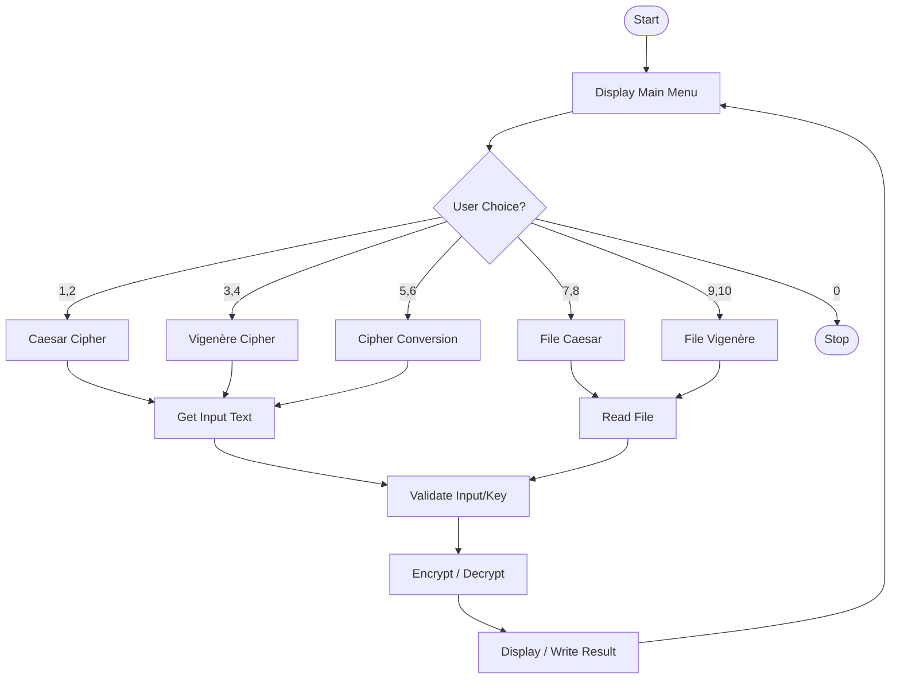

# 2.3 System / Module Design

## System Flowchart

## Modules Identified

The program is modularized into the following key functions:

1.  **`main()`**
    *   **Purpose**: Acts as the central controller. It displays the menu, accepts user choices, and routes execution to the appropriate logic blocks.

2.  **`getDynamicInput()`**
    *   **Purpose**: Handles dynamic memory allocation for user input, allowing for text of unlimited length (similar to Java's `Scanner` or Python's `input()`).

3.  **`getIntegerInput(prompt, min, max)`**
    *   **Purpose**: robustly gets an integer from the user, ensuring it is a valid number and falls within the specified range (e.g., menu choices 0-10, shift values 1-25).

4.  **`caesarEncrypt(text, shift)` / `caesarDecrypt(text, shift)`**
    *   **Purpose**: Performs the core logic for Caesar Cipher substitution. `caesarDecrypt` reuses `caesarEncrypt` with a reverse shift.

5.  **`vigenereEncrypt(text, key)` / `vigenereDecrypt(text, key)`**
    *   **Purpose**: Performs the core logic for Vigenère Cipher polyalphabetic substitution using a keyword.

6.  **`readFromFile(filename)` / `writeToFile(filename, content)`**
    *   **Purpose**: Handles all file I/O operations, including error checking for file existence, permissions, and memory allocation for file buffers.

7.  **`validateVigenereKey(key)`**
    *   **Purpose**: Sanitizes the Vigenère key by removing non-alphabetic characters and converting to uppercase to ensure consistent encryption.

## Data Flow Description

1.  **User Interaction**: The user interacts with the `main()` menu to select an operation (e.g., "Encrypt Text (Caesar)").
2.  **Input Acquisition**:
    *   For **Text Mode**: `getDynamicInput()` captures the plaintext/ciphertext string.
    *   For **File Mode**: `readFromFile()` reads the content from the specified disk file into a memory buffer.
3.  **Validation**:
    *   Numeric inputs (shifts, menu choices) are validated by `getIntegerInput()`.
    *   Encryption keys are cleaned and validated by `validateVigenereKey()`.
4.  **Processing**: The validated data is passed to the specific algorithm module (e.g., `caesarEncrypt()`). The function processes the text character-by-character, preserving case and ignoring non-alphabetic characters.
5.  **Output**:
    *   For **Text Mode**: The result is printed directly to the console.
    *   For **File Mode**: The result is passed to `writeToFile()`, which saves it to a new file on the disk.
6.  **Loop**: Control returns to the `main()` menu for the next operation.
